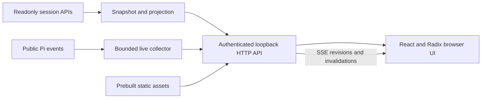

# Pi Session Inspector implementation plan

## Goal

Build a local, read-only, live web inspector for the current Pi session using React and Radix UI. Show the session tree, prompt history, tool and MCP calls, skill-use evidence, and codemode execution without changing the agent's model-visible context or active branch.

This document authorizes no implementation by itself. The initial implementation is project-local under `.pi/extensions/session-inspector/`; independent installation, promotion to a package, and publication require explicit user approval.

## Context

Research inspected the installed Pi declarations and implementations corresponding to the root manifest's Pi dependency, plus the official session, extensions, message-types, skills, MCP, and codemode documentation.

Verified integration points:

- `ctx.sessionManager` exposes `getTree()`, `getEntries()`, `getBranch()`, `getLeafId()`, and `buildSessionProjection()`.
- `ctx.getSystemPrompt()` exposes the current effective prompt; command context exposes `getSystemPromptOptions()` for structured inputs and skill discovery.
- System messages persist prompt sections and tool additions/removals; compaction can persist a system checkpoint. Older sessions can lack these records.
- `pi.getAllTools()` exposes configured tool metadata; `getActiveTools()` does not necessarily equal provider-visible declarations when loadout preparation hides tools.
- Nested tool events expose `parentToolCallId`. Persisted `nestedCalls` contains bounded metadata, not child results.
- Codemode source and final output are transcript data. Its discovery globals, model helpers, local variables, and internal scheduling do not all pass through ordinary tool events.
- `pi.getMcpServers()` covers extension-registered servers, not a complete built-in MCP connection-status view.
- Skills are advertised in prompt construction and loaded by reads or explicit commands; reading a skill is not evidence that the model followed it.
- Pi already exports interactive HTML with a tree. This is a useful behavior reference, not a live Radix frontend or an implementation to copy wholesale.

Repository evidence: `package.json` provides `npm run check`, `npm test`, `npm run format`, and the existing esbuild development dependency. Root TypeScript and Vitest discovery do not include `.pi/extensions/`; local checks must be explicit. `.pi/extensions/runtime-diagnostics/` exists, but the inspector must not import or assume its private implementation or diagnostic tool availability.

## Architecture

- Keep entrypoint, implementation, browser source, build helper, documentation, local configuration, and tests within `.pi/extensions/session-inspector/`.
- Do not add a local package manifest, workspace, Changeset, root extension registration, root test support, or shared TypeScript configuration.
- Use React, Radix Themes, Radix Primitives where Themes lacks the interaction, Radix Icons, and Themes/Colors tokens. Bundle browser dependencies into static assets so runtime auto-discovery needs no browser build server.
- Prefer the existing esbuild tool over introducing Vite for a static browser bundle. If new frontend development dependencies are needed, record their purpose and add only required root development dependencies; confirm the local build and runtime boundary first.
- Use Node HTTP and SSE rather than an additional server framework or WebSocket. Serve a snapshot, paginated details, and versioned live invalidations. SSE is not a public remote API.
- Use `/session-inspector` as a frequent single-action command to open the viewer. Explicitly validate its arguments and define supported modes before implementation; do not add agent tools.
- Previewing a branch only changes browser selection. Never call tree-navigation, fork, model-change, tool-execution, or prompt mutation APIs from browser endpoints.
- Scope server, token, collector, clients, and pending work by `sessionManager` and runtime generation. Start serving only on explicit command use, not factory load; shutdown or session replacement closes the old resources and invalidates credentials.
- Default to bounded in-memory collection after explicit activation. Explain the sensitive-data exposure before enabling detailed child-result recording; do not silently persist traces or add settings files.
- Keep raw history, Pi context projection, current effective prompt, and hook-observed request data distinct. A hook snapshot is not a guaranteed final HTTP request.

## Non-Goals

Remote access, cloud upload, session sharing, browser-controlled agent actions, complete MCP connection management, JavaScript single-stepping, sandbox variable inspection, inferred Promise dependency graphs, and automatic durable trace storage are out of scope.

## Applicable MUST rules and verification

| Touched area | Required contract | Named verification |
| --- | --- | --- |
| Project-local boundary | Keep local implementation and tests together; no package promotion or root registration. | Review of paths, imports, and manifest diff. |
| Lifecycle | No factory-owned server/tasks; idempotent cleanup on partial startup, cancellation, replacement, reload, and shutdown; revalidate ownership after awaits. | Test controllable pending operations and separate sessions; Pi Smoke. |
| Commands and modes | Validate accepted arguments; guard TUI-only flows; expose results or rejection through a supported channel without corrupting JSON/RPC. | Test TUI, RPC, JSON, and print contracts; Review command docs. |
| Prompt-cache stability | Observe without changing prompt, ordered messages, tools, or existing request prefix. | Test identical normalized model-visible inputs with inspector enabled and disabled. |
| Boundaries and privacy | Use public Pi APIs, sanitize untrusted display data, and avoid other extensions' private state. | Review imports/data flow; Test hostile text and unauthorized requests. |
| Settings | If implementation needs persistent settings, stop and revise this plan against `docs/extension-settings.md` before adding them. | Review scope; current design has no persistent settings. |
| Verification | Run root checks and tests separately, plus local checks and Pi smoke; document unavailable evidence honestly. | Validator, Test, Smoke, and semantic Review. |

Guides: `docs/extension-conventions.md`, `docs/extension-settings.md`, and root `AGENTS.md`. `docs/readme-conventions.md` becomes applicable only if separately approved package promotion changes this scope.

## Plan

### 1. Resolve data and build boundaries

- [x] Verify a minimal collector against the manifest-selected Pi runtime, producing fixtures for direct tools, parallel nested tools, nested errors/blocked calls, cancellation, resumed history, tree changes, compaction checkpoints, and context edits; accept only documented APIs with test-observed field availability.
- [x] Inventory observable versus missing codemode data, including discovery helpers and `models.*`; document which events represent child results, whether they precede or follow result-transforming hooks, and which claims must remain unavailable; acceptance is a capability table supported by fixtures and authoritative runtime inspection.
- [x] Validate local browser build and load paths using esbuild with a minimal Radix view; define local typecheck/test commands without root test/config support, confirm bundled assets resolve after auto-discovery, and record frontend dependency changes before building the full UI.
- [x] Freeze the command/mode contract, activation consent, memory budgets, SSE protocol, and unsupported-data labels; acceptance is adjacent documentation plus test cases for each accepted route and rejection.

### 2. Implement snapshots and live collection

- [x] Add typed snapshot/projection modules for tree roots, branch selection, raw entries, current leaf, prompt history, and context projection; fixtures must preserve abandoned branches, compaction, branch summaries, labels, unknown entry types, and context edits without mutating original entries.
- [x] Add tool inventory and call correlation using tool IDs and parent IDs; tests must distinguish configured, active, callable, and observed provider declarations rather than treating these sets as interchangeable.
- [x] Add a generic nested-call collector with bounded arguments/results, duration/status, redaction, and explicit `not captured`, `truncated`, and `unavailable` states; tests must cover parallel calls, multi-depth nesting, invalid arguments, cancellation, event ordering, and child calls that never produce a transcript entry.
- [x] Add skill-use evidence from documented structured inputs, explicit skill invocation messages, and observed reads; tests must distinguish advertised, explicitly invoked, successfully read, and unknown usage without claiming model compliance.
- [x] Add codemode presentation data from persisted script/output, documented nested metadata, and generic live events; tests must distinguish historical metadata from newly captured results and must not infer exact execution timing or unavailable helper results from source text.

### 3. Implement secure serving and lifecycle

- [x] Add loopback-only HTTP serving with a random per-session token, strict Host/Origin validation, authenticated snapshot/details/SSE routes, no permissive CORS, and no arbitrary filesystem endpoints; request tests must reject missing/wrong tokens, hostile origins/hosts, and path traversal.
- [x] Add bounded SSE queues and revisioned snapshot recovery; tests must cover disconnects, reconnect/resync, slow clients, collector overflow, and session-generation mismatch without replaying stale data.
- [x] Add activation/stop handling and idempotent teardown for server, sockets, clients, timers, and pending browser launch; lifecycle tests must cover cancelled consent, startup failure, repeated activation, `/reload`, session replacement, shutdown, and two headless sessions sharing a no-op UI.
- [x] Add private local browser launch with observable URL fallback and token-safe reporting; tests must prove cancellation and stale ownership cannot launch or expose an old session, and unsupported modes reject without opening UI or corrupting protocol output.

### 4. Implement the Radix web interface

- [x] Build a three-pane layout with a collapsible session tree, branch transcript, and detail inspector using Radix Themes/Primitives/Icons; browser tests must prove search/filter/selection behavior and that branch previews never mutate the Pi leaf.
- [x] Build Prompt, Tools/MCP, Skills, Context, and Raw detail tabs; fixture-backed UI tests must distinguish current runtime state, selected-node historical state, and incomplete or unavailable data.
- [x] Build codemode source/output views and nested-call expansion with parent links, status, captured results, and duration when available; UI tests must cover concurrent calls, errors, missing historical results, and large/truncated outputs.
- [x] Add safe text/Markdown/code/image rendering and responsive keyboard navigation; browser tests must cover malicious HTML/URLs/control sequences, focus behavior, light/dark appearance, narrow layouts, large session fixtures, and bounded lazy detail loading; add no remote fonts, scripts, or automatic link fetching.

### 5. Document and verify

- [x] Write `.pi/extensions/session-inspector/README.md` documenting command/mode behavior, build and local test commands, activation consent, ephemeral collection, browser/server lifecycle, security limits, and the capability table; review every user-visible claim against tests.
- [x] Run the agreed local build, local typecheck, local tests, and browser checks after a root `npm install`; record exact commands and finite fixture-based performance evidence, with every Vitest test within 5,000 ms and no timing assertions based on sleeps.
- [x] Run `npm run format`, inspect the intended diff, then run `npm run check` and `npm test` separately; record results, and do not run root gates concurrently with a Kit build/check.
- [x] Smoke explicit loading with `pi --no-extensions -e ./.pi/extensions/session-inspector/index.ts`, then verify trusted-project auto-discovery, `/reload`, live nested calls, branch preview, and shutdown in a real browser; record outcomes or specific unavailable paths rather than claiming untested compatibility.
- [x] Audit the complete diff against touched-area MUST rules, privacy boundaries, async ownership, and non-mutating request behavior; acceptance is a handoff naming guides, semantic audits, checks, smokes, deviations, and any unresolved evidence.

## Screenshot-directed interface revision

The user requests the supplied screenshot's interface form, not a color-only refresh: top identity/session bar, left tree and filter cards, center overview and expandable trace table, right formatted/JSON event inspector, and bottom connection bar. Metrics must use available public data; absent model durations and transport latency remain unavailable rather than fabricated.

- [x] Implement the screenshot's layout, hierarchy, styling and functional trace/filter/detail controls while preserving the local boundary and read-only data contract; acceptance is Chromium interaction tests and rendered screenshot inspection.
- [x] Verify bounded formatted/JSON previews, explicit copy failure reporting, lazy details, missing metrics, live updates and narrow/light layouts; acceptance is local types/tests and browser tests.
- [x] Update documentation/evidence, run both root gates and Pi smoke, audit the intended diff, and push the signed UI revision to PR #1510; leave user acceptance pending. Evidence: signed UI commit `ee7bd318` pushed to PR #1510; 22 local tests, six Chromium tests, Pi smoke and both root gates pass.

Applicable MUSTs: project-local boundaries, no model-visible mutations, safe display copies, async ownership/cancellation, deterministic tests and both repository gates. Verification methods: Review, local Validator/Test, Chromium visual/interaction Test and Pi Smoke.

## Progressive Session Explorer redesign

The user now authorizes a full interaction redesign: actual-parent hierarchical rows, independent selection/expansion, progressive inline data, keyboard tree navigation, List default, timing-correct Timeline, a compact metrics toolbar, collapsed live drawer, synchronized panels, resizable/collapsible desktop sides and accessible medium/narrow drawers.

- [x] Implement a shared iterative hierarchy/index and selection/reveal semantics without changing recorded parents; verify branches, orphan/cycle diagnostics, three-plus levels, retained descendant expansion, filters with ancestor context, keyboard navigation and bounded pagination.
- [x] Implement lazy inline details and collapsible JSON objects/arrays; keep selection separate from expansion, limit concurrent/cached detail work, cancel owned fetches and preserve literal/redacted display values; verify deep structured data and cancellation/failure behavior.
- [x] Record tool-start/end observation timestamps only for events actually observed; never synthesize missing starts from durations; verify shared-axis points/intervals, missing events, running calls, reversed clocks and native reported duration provenance.
- [x] Implement compact overview, non-auto-opening live drawer, semantic navigator labels, independent pane scrolling, tab overflow, pane resizing/collapse and Radix Dialog drawers; verify desktop, medium, narrow, effective 150% viewport, focus/escape, resize keyboard/pointer and live updates.
- [x] Run local build/types/tests, browser layout/interaction screenshots, Pi smoke and both root gates; audit privacy, lifecycle, source timing and model-prefix behavior; update evidence and push a signed PR revision. Evidence: 28 local tests, 12 Chromium tests, Pi smoke and both root gates passed; signed implementation `61251352` pushed to PR #1510. Desktop/narrow screenshots inspected; observer timing and effective-zoom limits documented.

UI hierarchy has no nesting-depth cap; existing bounded capture and 10,000-entry index limits remain explicit. Deep log chains use page-local indentation with absolute hierarchy levels and parent IDs retained. Filtering retains actual ancestors rather than inventing parent edges. Tool timing is labeled observer callback timing, not provider transport timing; log timestamps remain points. Model durations remain unavailable. Panel widths/view state are ephemeral UI state, not persisted settings.

Verification: local Validator/Test, Chromium interaction/visual Test, real Pi Smoke and semantic Review against root AGENTS.md and docs/extension-conventions.md; settings/publishing changes remain inapplicable. User acceptance of the original first version remains open.

## Context Composition revision

The current user request replaces the primary debugging dashboard with the supplied off-white vertical composition reference. Consent-gated public context_with_system observation supplies actual ordered Pi-stage messages; later hooks/provider serialization are explicitly not claimed as final. Before observation, native active-leaf projection is labeled session-derived. Log hierarchy and execution/debugging views remain secondary.

- [x] Capture bounded, immutable ordered context messages/blocks with explicit source, missing-token and truncation semantics; verify native projection, observer ordering, prefix equality, privacy and lifecycle disposal.
- [x] Implement a single-column, pastel composition list with inline details, category/search controls, bounded variable-height rendering and keyboard/jumpable minimap; verify independent disclosure, stable live/older scroll, mobile, light/dark and structured/raw data.
- [x] Preserve secondary session events, Navigator, Inspector, historical prompt/tools/skills/codemode and execution views; verify their existing regressions without forcing them onto the primary screen.
- [x] Inspect screenshot evidence against the reference, run local/root gates and Pi smoke, publish signed changes and report capture-stage/terminal/provider limitations; retain this plan until explicit user acceptance. Evidence: signed `20446e07` pushed to PR #1510; 76 local tests, 35 Chromium tests, explicit/trusted-discovery/reload/replacement Pi smoke and both root gates pass (7,461 root tests, one existing skip). Desktop/mobile-dark screenshots inspected; stage observations and unavailable token/transport/capture data are explicitly labeled.

Applicable MUST rules: public APIs and stage equivalence (Review + native/observer tests), unchanged normalized prefixes (runtime Test), bounded sanitized raw copies (privacy Test), owned cancellation/disposal (lifecycle/browser Test), accurate source/token labels (semantic Review), keyboard/focus/read-only previews (browser Test), local boundaries and both verification gates (Validator/Test/Smoke).

## Execution evidence

Implementation was authorized by the user's execution request. Completed implementation and automated acceptance evidence is recorded in [the local verification report](../../.pi/extensions/session-inspector/VERIFICATION.md): 22 local tests, six Chromium tests, Pi loading/mode/reload/replacement smokes, root checks, and 7,461 passing root tests with one existing skip. The selected diff contains only the local extension, required root development dependencies/lockfile/ignores, and this plan.

A physical terminal/default desktop opener and macOS/Windows opener behavior were not automated; the report records the deterministic substitutes and exact unverified paths. User acceptance remains pending, so this plan is retained and must not be reported as fully completed or deleted yet.

## Risks

- Missing historical child results cannot be reconstructed. Preserve metadata and label gaps instead of fabricating data.
- Public events may not expose final post-transformation values. Label the capture stage and test handler ordering; do not promise complete provider or MCP transport tracing.
- Tool outputs can contain secrets beyond recognizable credential keys. Use bounded ephemeral capture, explicit consent, no external requests, and a documented warning that redaction is not complete.
- Large sessions and streamed results can exhaust memory or stall Pi. Bound collectors and client queues, paginate details, coalesce invalidations, and keep event handlers lightweight.
- Radix does not provide a complete tree or execution graph. Own tree keyboard behavior explicitly; defer graph libraries until a concrete requirement exists.
- Root gates do not cover local extension types/tests. Maintain explicit local acceptance commands and report their evidence independently.

## Rollback / Recovery

The initial release does not migrate production data or publish an API. Stop the viewer or reload without the extension to revoke tokens and close serving resources; restart from the authoritative Pi snapshot after failed streaming or partial initialization. Do not modify or rewrite session history for recovery. If dependency or root tooling changes are made, revert only intended paths using Git. Durable storage or public packaging requires a revised plan and explicit approval.

## Completion Checklist

- [x] Discovery fixtures resolve or explicitly accept each material data/API limitation and the local build boundary.
- [x] Required tree, prompt, tool/MCP, skill-evidence, context, and codemode views pass local tests and browser acceptance.
- [x] Inspection leaves the Pi active branch and normalized model-visible request unchanged.
- [x] Authentication, privacy bounds, protocol behavior, and session-owned cleanup pass deterministic tests.
- [x] Local build/typecheck/tests, root `npm run check`, and root `npm test` pass with recorded commands.
- [x] Explicit-load, trusted auto-discovery, reload, live-browser, and shutdown smokes pass; any impractical path remains open until its limitation is explicitly accepted.
- [x] Documentation and semantic audit match the shipped capability and mode contracts; publication remains out of scope.
- [ ] User accepts the first-version behavior and remaining limitations; only then delete this completed plan and report its path.
